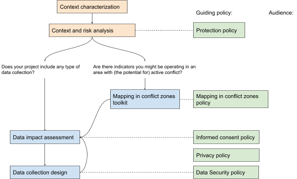

# Protection framework project planning
## Project team
Ivan, Jessie, Shazmane, Paul

External resources: option to procure external consultancy. Needs justification and definition of an RFP.

## Role and responsibilities:

| Owner        | Responsibilities                                                                                                     |
|--------------|----------------------------------------------------------------------------------------------------------------------|
| Paul         | Define the data policies framework with a goal per policy - with assigned tasks,  timeline, & sign off.              |
| Jessie       | Support on overall data policy structure and strategy, policy draft review.                                          |
| Ivan         | Draft policies, incorporate feedback into policies, manage consultants and RFP process.                              |
| Shazmane     | Consult on the goal and scope of each policy, discuss considerations per policy, conduct draft reviews, translations |
| (Hub staff?) | Sensitization, creation of training materials and trialing.                                                          |
|              |                                                                                                                      |

## Scope
What is in and out of scope?
*In scope* - policies that directly guide decision making on data collection activity (what to collect when and where) based on context, humanitarian principles, HOT’s values, and responsible activity.

*Out of scope* - logistical safety on the ground for field data collection.

## Approach
### Define milestones

1. Version 1 that covers our intended audiences. Key docs:
  - [Draft policy paper on mapping in conflict (GDoc)](https://docs.google.com/document/d/1SM_VUJ_Lhstv3gf9cwsqBWO2o4AQi4WEIVmob1Hbu9M/edit?usp=sharing) outlines the principles and policies that guide HOT's decisions about mapping in conflict and humanitarian settings.
  - [Draft toolkit](https://docs.google.com/document/d/134jufZsT7ErVmi3bI5vlPioNNmskplVH/edit?usp=sharing&ouid=103199202574829995989&rtpof=true&sd=true) to identify the kinds of contexts where the , and some guidance and resources to make decisions
2. External Review
3. open community process - engage with external interested stakeholders, such as Heather Leason (IFRC), Steve Penson (ACAPS), Gemma Davies (MapAction), others that have expressed interest. Nate Raymond? Amos Doornbos?

(Comms aspect?)
## Structure and prioritization

| Name                         | Purpose                                                                                        | Priority | Key questions                                                                                          |
|------------------------------|------------------------------------------------------------------------------------------------|----------|--------------------------------------------------------------------------------------------------------|
| Data Principles              | Incorporate HOT’s values, mission into guidelines for making responsible data decisions.       |          |                                                                                                        |
| Data Protection Policy       | Ensure the information for data collected in association to HOT does no harm.                  |          | Naming - is there something that communicates the purpose better (for our audience) than “protection”? |
| Mapping in Conflict Policy   | Extra steps to the Data Protection Policy in the sensitive context of conflict.                |          |                                                                                                        |
| Spatial Data Security Policy | Ensure that data collected via direct observation or remotely is managed and handled securely. |          |                                                                                                        |
| Data Impact Assessment       |                                                                                                |          |                                                                                                        |
| Data Collection Design       |                                                                                                |          | Connects closely to Impact areas & Tech (which mobile data collection tools to support)                |

## Timelines

| Milestone                             | ETA | Indicator |
|---------------------------------------|-----|-----------|
| Milestone 1: Internal                 |     |           |
| Milestone 2: open (community process) |     |           |
|                                       |     |           |

Milestone 1 components

## Resources
[IASC Operational Guidance on Data Responsibility in Humanitarian Action](https://interagencystandingcommittee.org/operational-response/iasc-operational-guidance-data-responsibility-humanitarian-action)

## Notes
- What is the starting point for a hub, looking to work with a community or subgrantee? 
- Implementation plans; how to actually apply, tools, training, responsibilities
  - 
  - 

