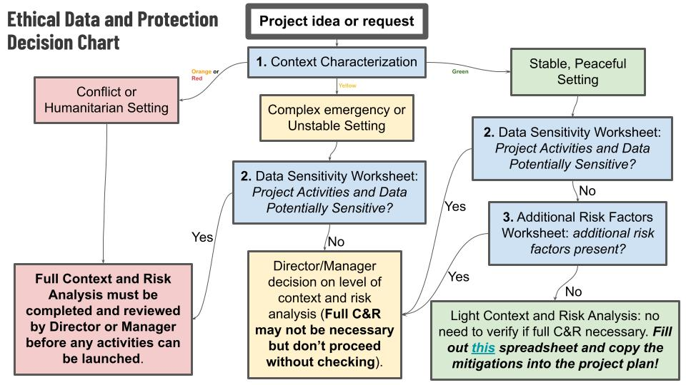

# HOTOSM Ethical Data and Protection Project

This is the public portal for HOT's policies, guidance, tools, and resources for Ethical Data and Protection in open humanitarian mapping.

The resources here are used internally by HOT Open Data Hubs, the Global team, and associated communities. However, in keeping with HOT's commitment to open data, public resources, collaboration, and above all community-first action, we are pleased to make this repository available to anyone&mdash;not only to read, but to contribute with content, suggestions, critiques, and resources.

# How to Use these Tools

First and foremost, this toolkit represents a process to think through Protection risk when starting new open mapping activities. At it's heart is a [checklist](https://github.com/hotosm/data_protection_project/blob/main/Tools_and_resourcs/01%20HOT%20New%20Project%20Ethical%20Data%20and%20Protection%20Checklist.docx) and [flowchart](https://github.com/hotosm/data_protection_project/blob/main/Tools_and_resourcs/02%20Ethical%20Data%20and%20Protection%20Decision%20Flowchart.pptx) which begin at the stage of a new project proposal and guide users through a rapid process to determine the baseline level of Protection risk and decide what Risk Assessment procedure to use.



There are additionally several worksheets:
- [Context Characterization worksheet]()
- [Data Senstivity worksheet]()
- [Additional Risk Factor worksheet]()


and an actual Risk Assessment spreadsheet template.

## How to get the toolkit
This is a GitHub repo, which is obviously somewhat tailored for people who are technically inclined. Fear not; it's mostly documents, spreadsheets, and slide decks, and [is available in a Google Drive folder](https://drive.google.com/drive/folders/11C_ltiwqzSP0TuUNVkVlUuTRJU7p6Tmi?usp=sharing) as well!

The Learning and Training folder contains a Powerpoint presentation with extensive speaker notes. It is most effective when used by an experienced trainer, but for people somewhat familiar with Protection concepts and risk assessment it may serve as a reasonable self-study resource.

However, for those of you that enjoy using Git (or would like to learn) this is really a nice way of making things available for people to contribute freely while retaining a consistent set of tools for end users.

### Download the Zip file and Get Started
The easiest way to use these tools is to click the green ```Code``` button near the top right of the screen, press ```Download ZIP```, and extract it onto your hard drive.

[You can also download the Zip file directly here](https://github.com/hotosm/data_protection_project/archive/refs/heads/main.zip)
You then have your very own local copy of everything that you can use, modify, personalize, and enjoy without messing it up for anyone else! You don't need a GitHub account or any tech skills other than the ability to extract a zip file [(like this)](https://support.microsoft.com/en-us/windows/zip-and-unzip-files-8d28fa72-f2f9-712f-67df-f80cf89fd4e5#:~:text=Do%20one%20of%20the%20following,and%20then%20follow%20the%20instructions.).

### Clone the Git Repo
If you are experienced with Git and Github, and particularly if you would like to contribute to this resource, it is better to clone or fork the repo (we assume if you are experienced with Git and Github you know how this works). This has two major advantages:
1. You can always get the most updated version of the tools by using ```git pull```
2. You can contribute your own suggested changes via a pull request, making the toolkit better for everyone!

